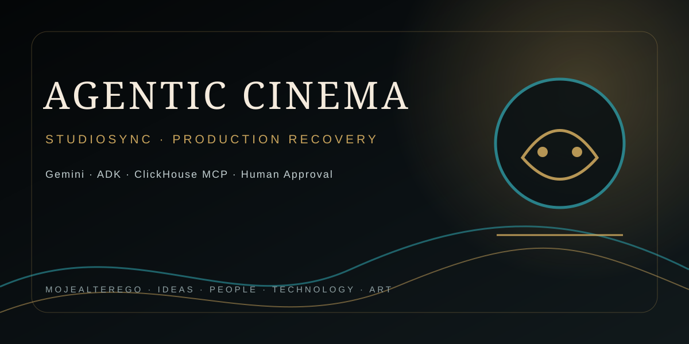

<div align="center">



</div>

---

# StudioSync

**Agentic production recovery for film & media — Gemini + Google ADK + ClickHouse MCP**

> **Built for Agentic Cinema: The Blockbuster Hackathon.**

StudioSync is an operational decision layer for film and media production. When a production disruption occurs, it turns an unstructured incident into an auditable recovery brief: scenario impact, ranked alternatives, budget delta, evidence provenance, confidence and human approval requirements.

This is deliberately **not** a video-generation chatbot. It targets the operational bottleneck between "something changed" and "the production team has a defensible recovery plan."

## Applicant

**Andrzej Mikulski**  
**Email:** mojealterego21@gmail.com  
**Phone:** +48 455 575 337

## Core workflow

```text
Production incident
       │
       ▼
StudioSync Coordinator
       │
       ▼
Parallel specialist analysis
 ┌──────────┬───────────┬────────────┐
 ▼          ▼           ▼
Scenario   Logistics   Financial Risk
Impact     Recovery      + ClickHouse MCP
 └──────────┴───────────┴────────────┘
       │
       ▼
Evidence-aware recovery brief
       │
       ▼
Human approval gate
```

## What is real vs. simulated

- **Demo mode:** deterministic synthetic data for immediate, reproducible judging without private credentials.
- **Configured runtime:** Google ADK + Gemini agent graph with ClickHouse MCP as the financial grounding layer.
- The application **never silently pretends that a synthetic result came from ClickHouse**.
- Consequential production actions are represented as approval requirements; the prototype does not claim external actions occurred unless a tool confirms them.

## Quick start

```bash
python -m venv .venv
source .venv/bin/activate
pip install -r requirements.txt
cp .env.example .env
./scripts/run_local.sh
```

Open `http://127.0.0.1:8080`.

Run tests:

```bash
pytest -q
```

## Configuration

Set the following environment variables for the configured cloud path:

```text
GOOGLE_CLOUD_PROJECT=your-project-id
GOOGLE_API_KEY=optional-local-key
GEMINI_MODEL=gemini-2.5-flash
CLICKHOUSE_MCP_URL=https://your-mcp-endpoint.example/mcp
CLICKHOUSE_MCP_AUTH_TOKEN=runtime-secret
STUDIOSYNC_MODE=demo
```

For deployment, store secrets in the platform secret manager rather than Git.

## Evaluation evidence

| Judging dimension | Evidence | Reviewer focus |
|---|---|---|
| Technological Implementation | `agents/orchestrator.py`, `app/main.py`, MCP configuration | Multi-agent decomposition + runtime integration path |
| Design | `web/index.html` | Incident-to-decision workflow and approval visibility |
| Potential Impact | `docs/GRANT_APPLICATION.md` | Measurable time-to-decision and reconciliation targets |
| Quality of Idea | Production recovery use case | Agentic control loop rather than content generation |

## Repository map

- `agents/` — agent graph and orchestration.
- `core/` — typed domain and evidence models.
- `services/` — reproducible demonstration fixtures.
- `app/` — FastAPI application surface.
- `web/` — production-operations cockpit.
- `docs/` — architecture, demo script, Devpost copy and grant application.
- `.github/workflows/` — CI.

## Evidence and responsible AI

StudioSync distinguishes **user input**, **synthetic fixtures**, **tool-retrieved evidence**, and **model inference**. Financial recommendations are intended to remain reviewable and traceable. The initial release follows least privilege and read-only analytics by default.

## Applicant

Andrzej Mikulski  
mojealterego21@gmail.com  
+48 455 575 337

## License

Apache-2.0
